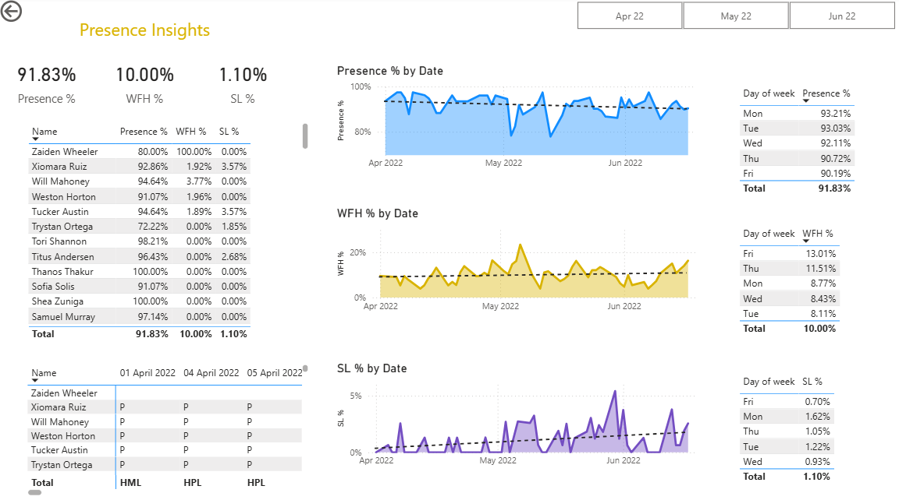

# HR-Dashboard

Data source - The dataset is taken from Youtube Channel Code Basics: https://www.youtube.com/watch?v=JC66t9eM10s&t=453s

Key Questions
1. What is the working preference of employee between WFH and WFO?
2. What is the trend of sick leave taken by employee over time?
3. What is presence percentage of the employee?

📌 Project Background
--> As data analyst, we need to collaborate with an HR representative from AtliQ Technologies, who provided detailed requirements for the dashboard. The HR team needed a centralized reporting solution to analyze employee presence and absence and their working behaviour between WFH and WFO.

🛠 Tools & Technologies Used
1. Power BI – For data visualization and interactive reporting.
2. Power Query (ETL Tool) – To connect, clean, and shape the dataset before loading into Power BI.
3. DAX (Data Analysis Expressions) – To create calculated measures such as presence rate, absentee rate, and trend metrics.
4. Excel / CSV – Raw dataset storage before ingestion into Power BI.

🔄 End-to-End Workflow

1. Data Acquisition: Received the raw employee presence dataset directly from AtliQ Technologies. Ensured data privacy by anonymizing sensitive employee information.
2. Data Cleaning & Transformation using Power Query: Removed duplicate entries and standardized date formats.
3. Defined calculated measures in DAX for key KPIs:
   a) Presence %
   b) Sick Leave (SL) %
   c) WFH %
   d) Presence count
   e) Sick Leave (SL) count
   f) WFH count
4. Dashboard Design: Built an interactive HR Presence Dashboard in Power BI featuring:
   a) KPI cards for quick HR overview comprising Present, WFH and SL %
   b) Line charts to slice and dice by time to show attendance pattern
5. Delivery & Insights: Delivered a single, interactive Power BI dashboard that HR could use to filter data dynamically.

Highlighted actionable insights, such as:
   a) Remote work spikes during specific periods.
   b) Seasonal attendance dips allowing HR to plan engagement activities.

📊 Results & Impact
1. Enabled HR to drill down into working pattern behaviour of WFH and WFO among epmloyee
2. With these insights, the HR team can organize targeted initiatives such as team-building activities or team lunches to improve engagement
3. If the company adopts a hybrid work model (e.g., two days working from home and three days in the office), these findings can support more accurate capacity planning.
4. Allows the organization to optimize workspace usage and potentially reduce infrastructure costs through better space utilization.

